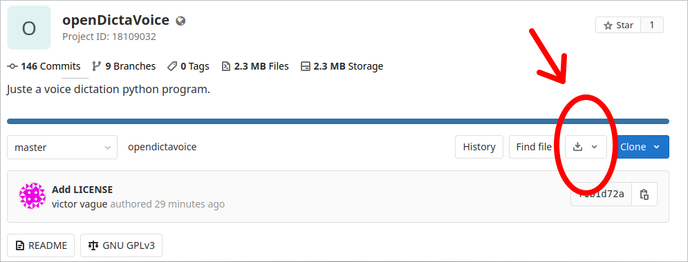
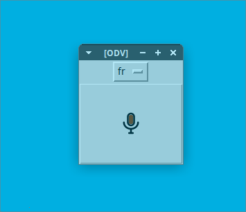
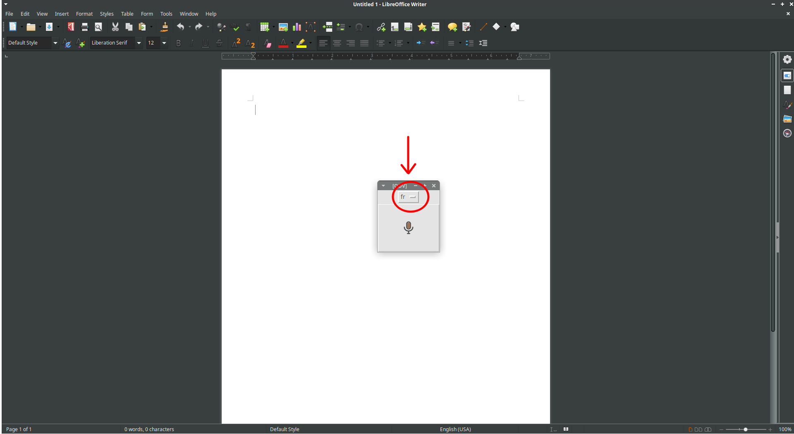
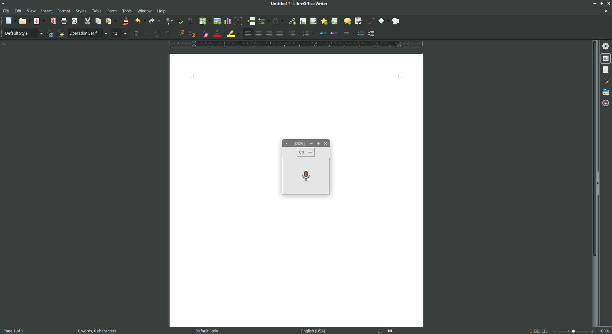
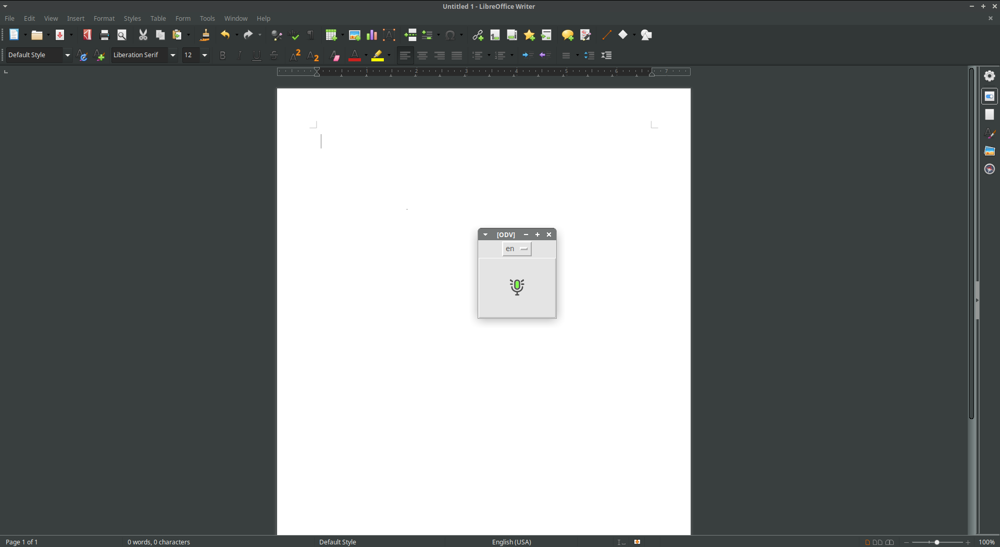
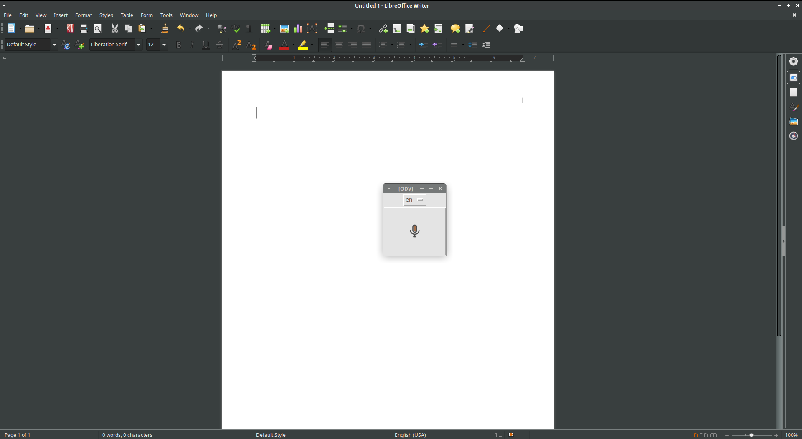
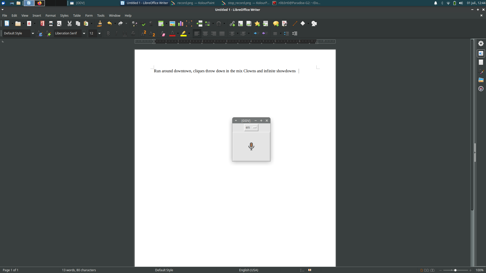
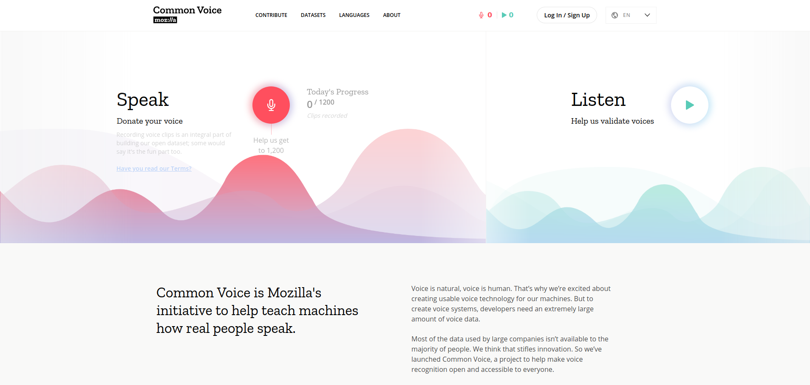

# OpenDictaVoice

## I) Description:

A voice dictation program written in **python3** to do voice dictation.

## II) Installation:

### Step 1: Download the program

Run the shell command:
```bash
git clone https://gitlab.com/Sleb/opendictavoice.git
```
&nbsp;  
**Or**, if you prefer, download the repository directly from gitlab



### step 2: Install dependencies


#### Firstly:
If you are using **Linux or MacOS**, it is necessary to install **portaudio** so that Python will be able to use the microphone once you allow it.

On **linux**, to install portaudio, run the shell command:
```bash
sudo apt-get install portaudio
```

On **MacOS**, to install portaudio, run the shell command:
```bash
brew install portaudio
```


#### Secondly:
if you are using **Linux**, it is necessary to install **tkinter for python3** (which is installed by default on Windows and MacOs).
To install it, run the shell command:
```bash
sudo apt-get install python3-tk
```


#### Finally:
OpenDictaVoice need the following modules installed to work (SpeechRecognition, pyaudio, pynput, python-xlib, six)

**You can install all dependancies automatically** by running, in the downloaded directory, the command:
```bash
pip install -r ./dependancies.txt
```

**But if you prefer to do it manually**, just follow steps bellow:

1) The OpenDictaVoice program uses **SpeechRecognotion** module to work, wich is available here:
[https://pypi.org/project/SpeechRecognition/](https://pypi.org/project/SpeechRecognition/)

To install it, run the shell command:
```bash
pip install SpeechRecognition
```

2) **PyAudio:** To install it, run the shell command:
```bash
pip install pyaudio
```

3) **pynput:** To install it, run the shell command:
```bash
pip install pynput
```

4) **python-xlib:** To install it, run the shell command:

```bash
pip install python-xlib
```

5) **six:** To install it, run the shell command:
```bash
pip install six
```

## III) How to use:

### Launch:

Go to the the dowloaded directory, then run the shell command:
```bash
python3 ./opendictavoice_app/opendictavoice_main.py
```

**Or**, launch the program by clicking on the opendictavoice_main.py file in your favorite file browser

Note: you can of course make a shortcut to the ```./opendictavoice_app/opendictavoice_main.py``` file to launch it easily.

### Utilization: 


It will open a window with low opacity that is always in the foreground.



By default the recognized language is in french. If you want to change it for the english you can do it with the scrolling menu.




Then, put the focus on the element you want to write in (libreoffice writer here in the example),



and when you want to speak, hold **CTRL + SHIFT** keys to launch the record.



When you release the CTRL + SHIFT keys, it will stop the record, analyse the recorded sound and then write the text where the focus is.





**Note**: if you don't want to use the **CTRL + SHIFT** hotkeys, you can click on the microphone button of the program to launch the record, and click again on it to stop the record.
This will then switch the focus using an ALT + TAB shortcut to get the focus on the element you wanted to write at first.

**Note 2**: You can start a new recording before the analysis of the first one is finished. Each recording is managed by a queue so that the recognized texts will always be written
in the order in which they were recorded. It is usefull to play for time.


## IV) To go further:

OpenDictaVoice is just a graphical interface to do voice dictation using a Speech To Text Engine. For now it uses "Google STT" or "CMU Sphinx" but if you have your own Speech To Text Engine 
(Created with Common Voice and DeepSpeech for example, [https://research.mozilla.org/machine-learning/](https://research.mozilla.org/machine-learning/)), you can use it with this program by modifying the source code.

Moreover, speech recognition is a major thing in a multitude of fields (ergonomics, new form of human-machine interface, assistance for disabled people, ...) and the possibility
of having this kind of technology accessible to all people in open source is most likely desirable. But the most precious commodity for this is voice samples...

Fortunately, we can all make this possible. There is an open source project you can ALL contribute to : **Common Voice** ([https://voice.mozilla.org/](https://voice.mozilla.org/))



Common Voice is a project built by Mozilla to constitute a large database of spoken text, which can be downloaded by everyone, to train algorithms in purpose to have its own voice recognition ! 

If only 1000 persons did 45 records every day during 6 month, the database would contain 10 000 hours of records which is enough to have a correct voice recognition !

So if you want to make speech recognition incredibly efficient and accessible for everyone as GNU-linux is, contribute in Common voice, even 5 small recordings per week is already great.


